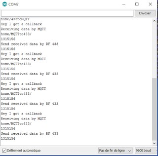
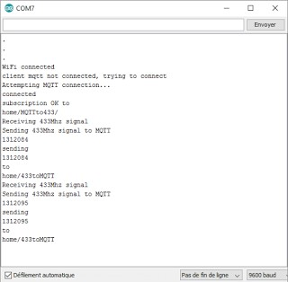
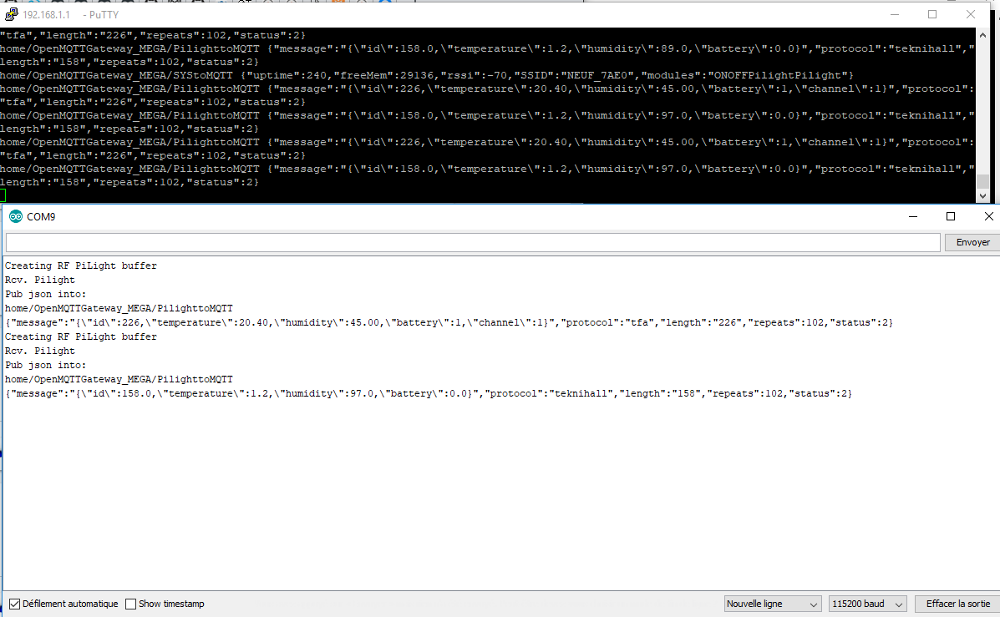

Note that for the moment RF, RF2 and Pilight can not be activated on the same boards together.

## RF gateway

### Receiving data from RF signal

Subscribe to all the messages with mosquitto or open your MQTT client software:

`    sudo mosquitto_sub -t +/# -v`

Generate your RF signals by pressing a remote button or other and you should see :

`home/OpenMQTTGateway/433toMQTT {"value":1315156,"protocol":1,"length":24,"delay":317}`

### Send data by MQTT to convert it on RF signal 

`mosquitto_pub -t "home/OpenMQTTGateway/commands/MQTTto433" -m '{"value":1315156}'`

This command will send by RF the code 1315156 and use the default parameters (protocol 1, delay 350)

Arduino IDE serial data received when publishing data by MQTT



We see that the Arduino receive the value 1315156 on the MQTT subject "MQTTto433" and send the data by RF

Arduino IDE serial data received when receiving data by 433Mhz



### Send data by MQTT with advanced RF parameters

RF sending support three advanced parameters; bits length, RF protocol and RF pulselength
if you want to use a different RCswitch protocol put inside your payload the protocol number 2, "protocol":2.

if you want to use a pulselength 315 put inside your topic "delay":315

if you want to use a bits number different than 24 put inside your topic "length":24 for example

Example:
`mosquitto_pub -t "home/OpenMQTTGateway/commands/MQTTto433" -m '{"value":1315156,"protocol":2,"length":24,"delay":315}'`
will make RCSwitch use the protocol 2 with a pulselength of 315ms and a bits number of 24

### Repeat the RF signal OpenMQTTGateway receive
So as to repeat the RF signal received by the gateway once set the following parameter to true in config_RF.h

`#define repeatRFwMQTT true`

### Repeat the RF signal several times
You can add a "repeat" key/value to the MQTTto433 JSON message to override the default number of repeats.

Example:
`home/OpenMQTTGateway/commands/MQTTto433 {"value":1315156,"protocol":1,"length":24,"delay":317, "repeat":10}`

## Pilight gateway

### Receiving data from RF signal

Subscribe to all the messages with mosquitto or open your MQTT client software:

`    sudo mosquitto_sub -t +/# -v`

Generate your RF signals by pressing a remote button or other and you will see :



### Send data by MQTT to convert it on RF signal 
**ON**

`mosquitto_pub -t "home/OpenMQTTGateway/commands/MQTTtoPilight" -m '{"message":"{\"systemcode\":12,\"unitcode\":22,\"on\":1}","protocol":"elro_400_switch"}'`

**OFF**

`mosquitto_pub -t "home/OpenMQTTGateway/commands/MQTTtoPilight" -m '{"message":"{\"systemcode\":12,\"unitcode\":22,\"off\":1}","protocol":"elro_400_switch"}'`

Theses commands will send by RF the signals to actuate an elro_400 switch

## RF with SONOFF RF BRIDGE
### Receiving data from RF signal

Subscribe to all the messages with mosquitto or open your MQTT client software:

`    sudo mosquitto_sub -t +/# -v`

Generate your RF signals by pressing a remote button or other and you will see:
```
home/OpenMQTTGateway/SRFBtoMQTT {"raw":"2B660186042E00E7E5","value":"59365","delay":"1111","val_Thigh":"390","val_Tlow":"1070"}
```

The first parameter is the raw value extracted from the RF module of the Sonoff bridge. The data are in hexadecimal and correspond to the details below:
https://www.itead.cc/wiki/images/5/5e/RF_Universal_Transeceive_Module_Serial_Protocol_v1.0.pdf
OpenMQTTGateway process the raw value to extract the other decimal values that can be reused to reproduce a signal (raw value can also be reused).

NOTE: currently the device doesn't receive correct values from Switches remote control

### Send data by MQTT to convert it on RF signal 
`mosquitto_pub -t "home/OpenMQTTGateway/commands/MQTTtoSRFB" -m '{"value":1315156}'`

This command will send by RF the code 1315156 and use the default parameters:
Repeat = 1
Low time= 320
High time= 900
SYNC = 9500

### Send data by MQTT with advanced RF parameters

RF bridge sending support four advanced parameters; Repeat, Low time, High time & Sync
if you want to repeat your signal sending put into your json payload "repeat":2, 2 means 2 repetitions of signal

if you want to use a low time of 315 put inside your json payload "Tlow":315

if you want to use a high time of 845 put inside your json payload "Thigh":845

if you want to use a sync time of 9123 put inside your json payload "Tsyn":9123 

Example:
`mosquitto_pub -t home/OpenMQTTGateway/commands/MQTTtoSRFB/Tlow_315/Thigh_845/Tsyn_9123 -m '{"value":"33151562","delay":"9123","val_Thigh":"845","val_Tlow":"315"}'`
will make RF Bridge send a signal with the use of listed parameters 315, 845, 9123...

`mosquitto_pub -t home/OpenMQTTGateway/commands/MQTTtoSRFB/Raw -m '{"raw":"267A013603B6140551"}'`
will make RF Bridge send a signal with the use of advanced parameters defined in the raw string

## RF2 gateway KAKU
RF2 gateway enables to send command to RF devices with the KAKU protocol. DIO chacon devices are an example.
It uses the same pinout as the RF gateway and both gateways can be used on the same setup.

Receiving RF codes with the KAKU protocol is not compatible with ZgatewayRF , so as to get the code of your remotes you should comment ZgatewayRF in user_config.h.
Transmitting can be done with both ZgatewayRF and ZgatewayRF2

### Receiving data from KAKU signal

Subscribe to all the messages with mosquitto or open your MQTT client software:

`    sudo mosquitto_sub -t +/# -v`

Generate your RF signals by pressing a remote button or other and you will see :

`home/OpenMQTTGateway/RF2toMQTT {"unit":0,"groupBit":0,"period":273,"address":8233228,"switchType":0}`

### Send data by MQTT to convert it on KAKU signal 

Once you get the infos publish the parameters with mqtt like that for off:

`mosquitto_pub -t home/OpenMQTTGateway/commands/MQTTtoRF2 -m "{"unit":0,"groupBit":0,"period":273,"address":8233228,"switchType":0}"`

for on:

`mosquitto_pub -t home/OpenMQTTGateway/commands/MQTTtoRF2 -m "{"unit":0,"groupBit":0,"period":273,"adress":8233228,"switchType":1}"`
